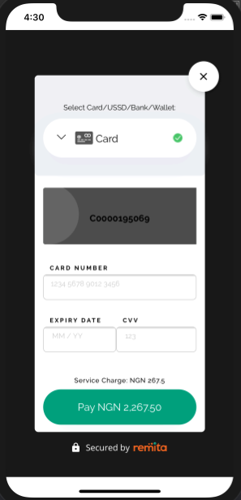

# Remita Inline Payment SDK for iOS

---
- [Overview](#Overview)
- [Installation](#Installation)
- [Usage](#Usage)
- [Contributing](#Contributing)
- [License](License)

---

## Overview
The following pages outlines the steps to integrating Remita Inline Payment SDK to your app.


---
## Installation

**Note:** This setup is done on XCode 10.3, Swift 5.0.1, on Mac OS X(64bit) Mojave

1. Right click on your project root file, go to **Add Files to < Project name > . . . ** and click

2. Browse to the cloned SDK and select **RemitaPaymentGateway.xcodeproj**, check 'Copy items if needed' and 'Create groups' click on add.

3. Select **RemitaPaymentGateway.framework** drag and drop  under "Embedded Binaries" section to add the sdk  to your project.

4. Rebuild project

---

## Usage

You should invoke paymentGateway: RemitaPaymentGateway = RemitaPaymentGateway() then paymentGateway.initiatePayment() with valid parameters at any point when making payment:

**Sample Code:**
```swift
import UIKit
import RemitaPaymentGateway

class ViewController: UIViewController, RemitaPaymentGatewayDelegate {

override func viewDidLoad() {
super.viewDidLoad()
// Do any additional setup after loading the view, typically from a nib.
}

override func didReceiveMemoryWarning() {
super.didReceiveMemoryWarning()
// Dispose of any resources that can be recreated.
}

@IBAction func payButton(_ sender: UIButton) {
let paymentGateway: RemitaPaymentGateway = RemitaPaymentGateway()
paymentGateway.delegate = self

let url: String = Constants.DEMO.rawValue

let rrr: String = "110008238929"

paymentGateway.initiatePayment(on: self, url:url, key: "QzAwMDAxOTUwNjl8NDMyNTkxNjl8ZTg0MjI2MDg4MjU0NzA2NTY2MTYwNGU1NjNiMjUzYjk4ZDQwZjljZGFiMTVmYTljMDUwMGQ0MDg2MjIyYjEyNTA1ZTE2MTMxNmE3ZjM1OTZmYmJkOTE2MTRiY2NmZTY5NTM4MGQ2MDBlZGJlZmM2ODc2YTc2M2M4MjgyZmFjODc=", rrr:rrr)
}

func onPaymentCompleted(paymentResponse: PaymentResponse) {
print("+++ RESPONSE: \(String(describing: paymentResponse))")
}

}
 ```


Where url can be:

**Constants.DEMO.rawValue** (for testing) and **Constants.PRODUCTION.rawValue** (for live).


### Test cards


```json
              CARD: 5178 6810 0000 0002,  
              Expire Date : 05/30,  
              CCV: 000, 
              OTP: 123456
```
### Useful links
Join our Slack Developer/Support channel on [Slack.](http://bit.ly/RemitaDevSlack)
    
### Support
For all other support needs, support@remita.net

---

## Contributing
To contribute to this repo, follow these guidelines for creating issues, proposing new features, and submitting pull requests:

1. Fork the repository.
2. Create a new branch: `git checkout -b "feature-name"`
3. Make your changes and commit: `git commit -m "added some new features"`
4. Push your changes: `git push origin feature-name`
5. Submit a Pull Request (PR).

Thank you!

---

## License

This project is licensed under the MIT License - see the [LICENSE.md](LICENSE.md) file for details.
